<div align="center">

# 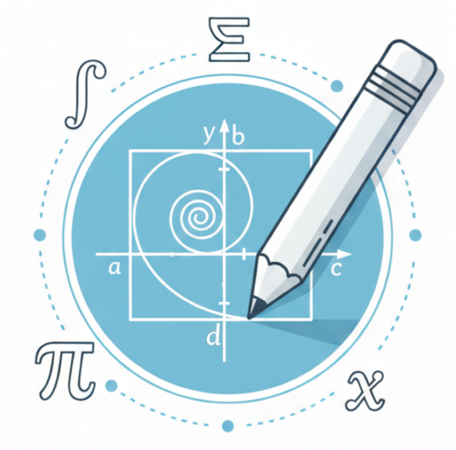 MathCanvas

## Intrinsic Visual Chain-of-Thought for Multimodal Mathematical Reasoning

<p>
    <a href="https://mathcanvas.github.io/" target="_blank"></a>
    <a href="https://arxiv.org/abs/..." target="_blank"></a>
    <a href="https://github.com/shiwk24/MathCanvas" target="_blank"></a>
    <a href="https://mathcanvas.github.io/#leaderboard" target="_blank"></a>
    <a href="https://huggingface.co/shiwk24/BAGEL-Canvas" target="_blank"></a>

</p>

<details>
  <summary></summary>
  <p>
    <a href="https://huggingface.co/datasets/shiwk24/MathCanvas-Bench" target="_blank">MathCanvas-Bench</a>&ensp;·&ensp;
    <a href="https://huggingface.co/datasets/shiwk24/MathCanvas-Instruct" target="_blank">MathCanvas-Instruct</a>&ensp;·&ensp;
    <a href="https://huggingface.co/datasets/shiwk24/MathCanvas-Edit" target="_blank">MathCanvas-Edit</a>&ensp;·&ensp;
    <a href="https://huggingface.co/datasets/shiwk24/MathCanvas-Imagen" target="_blank">MathCanvas-Imagen</a>&ensp;·&ensp;
  </p>
</details>


<br>

<p>
<a href="https://scholar.google.com/citations?user=GjRC15wAAAAJ&hl=en" target="_blank">Weikang Shi</a><sup>1*</sup>,&ensp;
<a href="https://aldrichyu.github.io/" target="_blank">Aldrich Yu</a><sup>1*</sup>,&ensp;
<a href="https://rongyaofang.github.io/" target="_blank">Rongyao Fang</a><sup>1*†</sup>,&ensp;
<a href="https://scholar.google.com/citations?user=reSJxKkAAAAJ&hl=zh-CN" target="_blank">Houxing Ren</a><sup>1</sup>,&ensp;
<a href="https://wangk.org/" target="_blank">Ke Wang</a><sup>1</sup>,&ensp;
<a href="https://scholar.google.com/citations?user=cC8lXi8AAAAJ&hl=zh-CN" target="_blank">Aojun Zhou</a><sup>1</sup>,&ensp;
<a href="https://scholar.google.com/citations?user=kQ3AisQAAAAJ&hl=zh-CN" target="_blank">Changyao Tian</a><sup>1</sup>,
<br>
<a href="https://cynricfu.github.io/" target="_blank">Xinyu Fu</a><sup>2</sup>,&ensp;
<a href="https://scholar.google.com/citations?user=nk2R0cMAAAAJ&hl=en" target="_blank">Yuxuan Hu</a><sup>1</sup>,&ensp;
<a href="https://scholar.google.com/citations?user=ewuGUCwAAAAJ&hl=en" target="_blank">Zimu Lu</a><sup>1</sup>,&ensp;
<a href="https://leonhlj.github.io/" target="_blank">Linjiang Huang</a><sup>3</sup>,&ensp;
<a href="https://colalab.net/" target="_blank">Si Liu</a><sup>3</sup>,&ensp;
<a href="https://ruiliu-ai.github.io/" target="_blank">Rui Liu</a><sup>2‡</sup>,&ensp;
<a href="https://www.ee.cuhk.edu.hk/~hsli/" target="_blank">Hongsheng Li</a><sup>1‡</sup>
</p>

<p>
<sup>1</sup>MMLab, CUHK&ensp;&ensp; <sup>2</sup>Huawei Research&ensp;&ensp; <sup>3</sup>BUAA
<br>
<small><sup>†</sup>Equal Contribution&ensp;&ensp; <sup>‡</sup>Project Lead&ensp;&ensp; <sup>*</sup>Corresponding Author</small>
</p>

</div>

## 📖 Introduction

🌟 This is the official repository for the paper **"MathCanvas: Intrinsic Visual Chain-of-Thought for Multimodal Mathematical Reasoning"**. This repository will host the datasets, evaluation code, and models associated with our work.

<p align="center">
  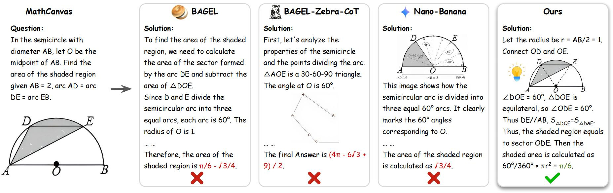
</p>
<p align="center">
  <small><i>
    MathCanvas demonstrates the first successful application of intrinsic Visual Chain-of-Thought (VCoT) for complex mathematical reasoning, outperforming previous attempts.
  </i></small>
</p>

**MathCanvas** is a comprehensive framework designed to endow unified Large Multimodal Models (LMMs) with intrinsic **Visual Chain-of-Thought (VCoT)** capabilities for mathematics. Our approach enables models to strategically generate and reason with visual aids, mirroring how humans solve complex problems in domains like geometry and function analysis.

## ✨ Highlights

### MathCanvas-Bench & MathCanvas-Instruct

To facilitate rigorous evaluation, we introduce **MathCanvas-Bench**, a challenging benchmark with 3K problems that require models to produce interleaved visual-textual solutions. The models are fine-tuned on **MathCanvas-Instruct**, a new 219K-example dataset of interleaved visual-textual reasoning paths, teaching them *when* and *how* to leverage visual aids.

<p align="center">
  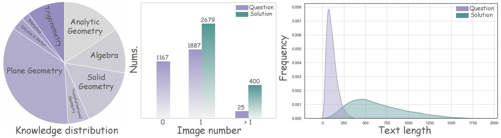
</p>
<p align="center">
  <small><i>
    Statistical analysis of the MathCanvas-Instruct and MathCanvas-Bench datasets.
  </i></small>
</p>

<details>
  <summary>Examples from the MathCanvas-Instruct dataset, showing interleaved visual and textual reasoning steps.</summary>
  <p align="center">
    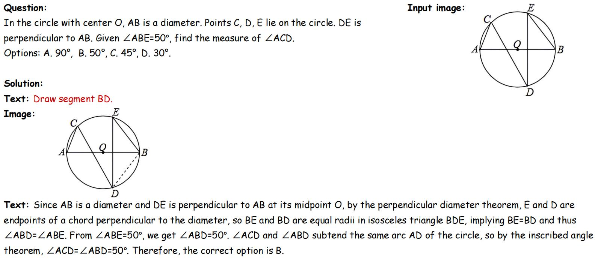
    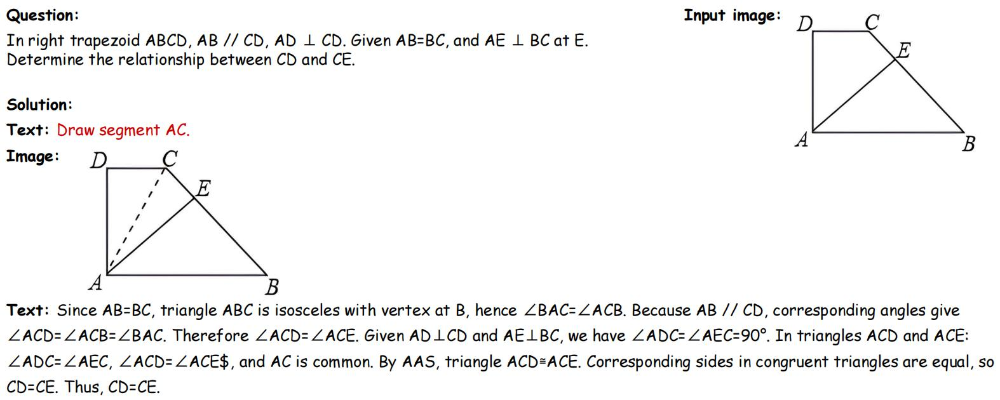
    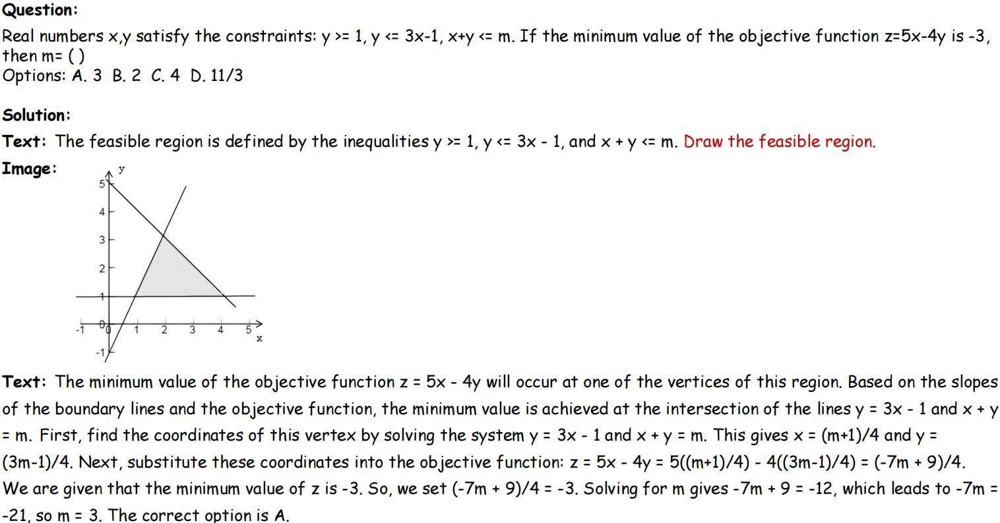
  </p>
</details>

### MathCanvas-Edit & MathCanvas-Imagen

We constructed a massive 15.2M-pair pre-training corpus to teach foundational visual manipulation skills. This includes **MathCanvas-Imagen** (10M caption-to-diagram pairs) for mastering diagram generation and **MathCanvas-Edit** (5.2M step-by-step editing trajectories) for diagram editing.

<p align="center">
  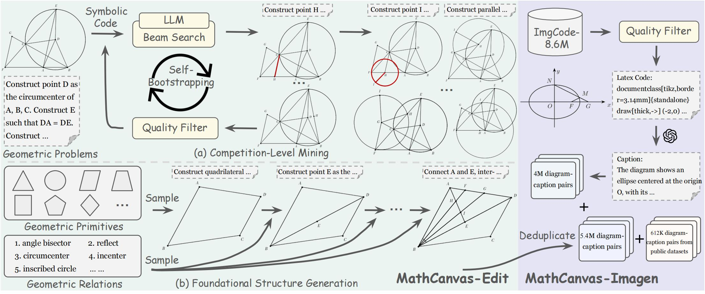
</p>
<p align="center">
  <small><i>
    The curation pipeline for the MathCanvas-Edit and MathCanvas-Imagen datasets.
  </i></small>
</p>

<details>
  <summary>Examples from the MathCanvas-Edit and MathCanvas-Imagen datasets.</summary>
  <p align="center">
    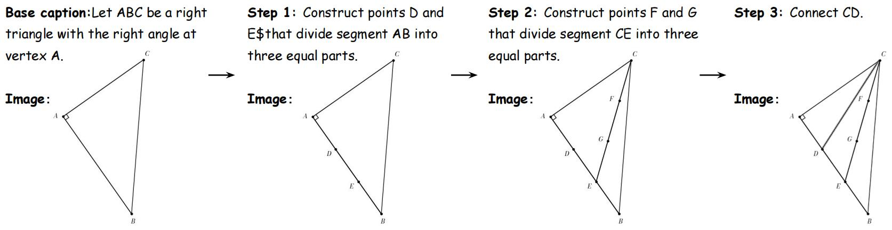
    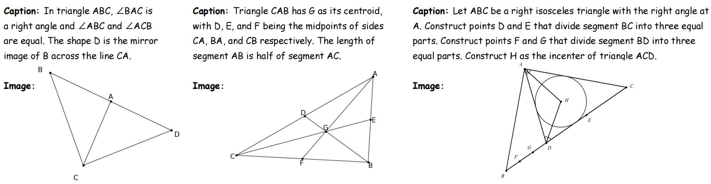
    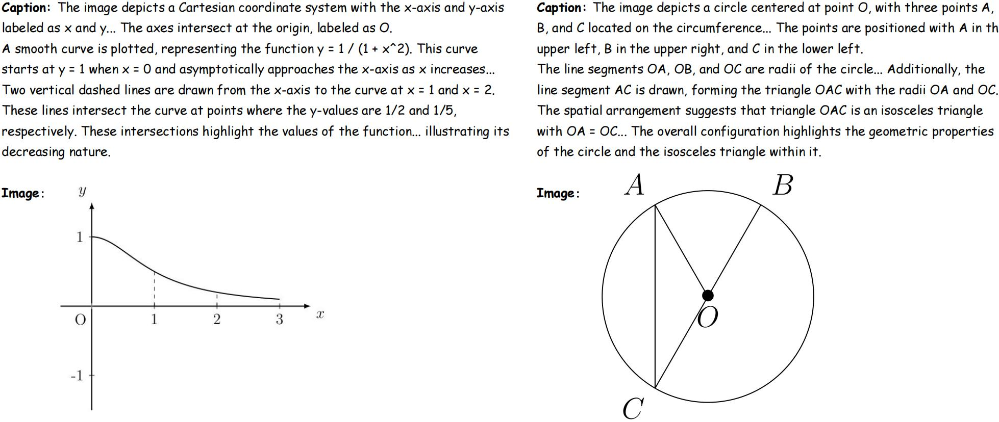
  </p>
</details>

### Two-Stage Training Recipe

Our model, **BAGEL-Canvas**, is trained using a two-stage framework:
1.  **Stage I: Visual Manipulation:** Pre-training on MathCanvas-Imagen and MathCanvas-Edit.
2.  **Stage II: Strategic Visual-Aided Reasoning:** Fine-tuning on MathCanvas-Instruct.

<p align="center">
  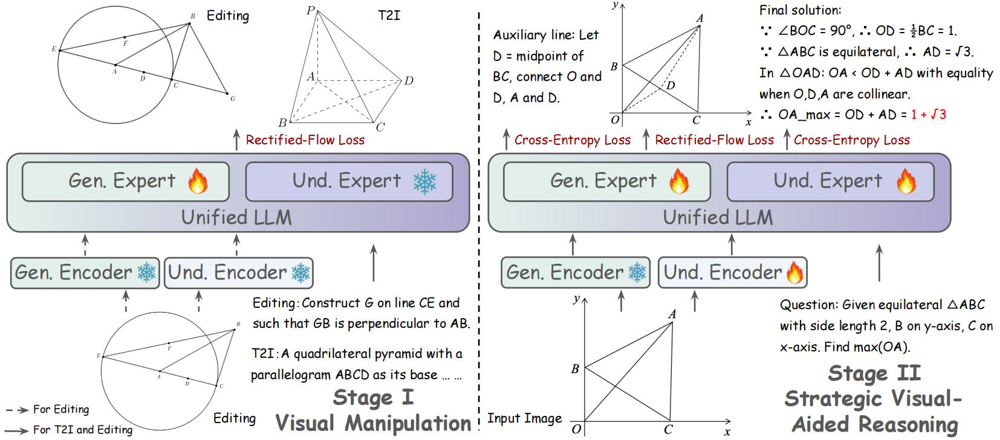
</p>
<p align="center">
  <small><i>
    The two-stage training framework of MathCanvas.
  </i></small>
</p>

## 📝 TODO

Our code and models are currently being prepared for public release. We appreciate your patience!

- [ ] Release training and inference code for **BAGEL-Canvas**.
- [ ] Release evaluation scripts for the **MathCanvas-Bench**.
- [ ] Release the data generation code for **Foundational Structure Generation** in MathCanvas-Edit.

## 📜 Citation

If you find our work useful for your research, please consider citing our paper:

```bibtex
