<div align="center">

# 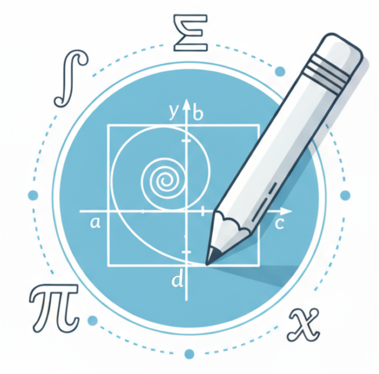 MathCanvas

## Intrinsic Visual Chain-of-Thought for Multimodal Mathematical Reasoning

<p>
    <a href="https://mathcanvas.github.io/" target="_blank"></a>
    <a href="https://arxiv.org/pdf/2510.14958" target="_blank"></a>
    <a href="https://github.com/shiwk24/MathCanvas" target="_blank"></a>
    <a href="https://mathcanvas.github.io/#leaderboard" target="_blank"></a>
    <a href="https://huggingface.co/shiwk24/BAGEL-Canvas" target="_blank"></a>

</p>

<details>
  <summary></summary>
  <p>
    <a href="https://huggingface.co/datasets/shiwk24/MathCanvas-Bench" target="_blank">MathCanvas-Bench</a>&ensp;·&ensp;
    <a href="https://huggingface.co/datasets/shiwk24/MathCanvas-Instruct" target="_blank">MathCanvas-Instruct</a>&ensp;·&ensp;
    <a href="https://huggingface.co/datasets/shiwk24/MathCanvas-Edit" target="_blank">MathCanvas-Edit</a>&ensp;·&ensp;
    <a href="https://huggingface.co/datasets/shiwk24/MathCanvas-Imagen" target="_blank">MathCanvas-Imagen</a>&ensp;·&ensp;
  </p>
</details>


<br>

<p>
<a href="https://scholar.google.com/citations?user=GjRC15wAAAAJ&hl=en" target="_blank">Weikang Shi</a><sup>1*</sup>,&ensp;
<a href="https://aldrichyu.github.io/" target="_blank">Aldrich Yu</a><sup>1*</sup>,&ensp;
<a href="https://rongyaofang.github.io/" target="_blank">Rongyao Fang</a><sup>1*†</sup>,&ensp;
<a href="https://scholar.google.com/citations?user=reSJxKkAAAAJ&hl=zh-CN" target="_blank">Houxing Ren</a><sup>1</sup>,&ensp;
<a href="https://wangk.org/" target="_blank">Ke Wang</a><sup>1</sup>,&ensp;
<a href="https://scholar.google.com/citations?user=cC8lXi8AAAAJ&hl=zh-CN" target="_blank">Aojun Zhou</a><sup>1</sup>,&ensp;
<a href="https://scholar.google.com/citations?user=kQ3AisQAAAAJ&hl=zh-CN" target="_blank">Changyao Tian</a><sup>1</sup>,
<br>
<a href="https://cynricfu.github.io/" target="_blank">Xinyu Fu</a><sup>2</sup>,&ensp;
<a href="https://scholar.google.com/citations?user=nk2R0cMAAAAJ&hl=en" target="_blank">Yuxuan Hu</a><sup>1</sup>,&ensp;
<a href="https://scholar.google.com/citations?user=ewuGUCwAAAAJ&hl=en" target="_blank">Zimu Lu</a><sup>1</sup>,&ensp;
<a href="https://leonhlj.github.io/" target="_blank">Linjiang Huang</a><sup>3</sup>,&ensp;
<a href="https://colalab.net/" target="_blank">Si Liu</a><sup>3</sup>,&ensp;
<a href="https://ruiliu-ai.github.io/" target="_blank">Rui Liu</a><sup>2‡</sup>,&ensp;
<a href="https://www.ee.cuhk.edu.hk/~hsli/" target="_blank">Hongsheng Li</a><sup>1‡</sup>
</p>

<p>
<sup>1</sup>MMLab, CUHK&ensp;&ensp; <sup>2</sup>Huawei Research&ensp;&ensp; <sup>3</sup>BUAA
<br>
<small><sup>*</sup>Equal Contribution&ensp;&ensp; <sup>†</sup>Project Lead&ensp;&ensp; <sup>‡</sup>Corresponding Author</small>
</p>

</div>

## 💥 News

- **[2026-04-14]** 🎉 Our paper has been accepted to ACL 2026 Main Conference!
- **[2025-11-15]** Our MathCanvas-Instruct dataset--219k math problems with interleaved visual-text reasoning is now accessible at [Huggingface](https://huggingface.co/datasets/shiwk24/MathCanvas-Instruct).
- **[2025-10-30]** 🚀 We are excited to announce that **MathCanvas-Bench** is now officially supported by [VLMEvalKit](https://github.com/open-compass/VLMEvalKit)! This allows for easy evaluation on over **220+ LMMs**. For usage instructions, please refer to [this PR](https://github.com/open-compass/VLMEvalKit/pull/1292).
- **[2025-10-28]** The data generation code for the **Foundational Structure Generation** part of `MathCanvas-Edit` is now available. Refer to the [Data Generation](#-data-generation) section for usage instructions.
- **[2025-10-23]** We release the [training/inference code](./BAGEL-Canvas/) of BAGEL-Canvas and [evaluation scripts](./evaluation/) for MathCanvas-Bench.
- **[2025-10-18]** Our model and datasets are now accessible at [Huggingface](https://huggingface.co/collections/shiwk24/mathcanvas).
- **[2025-10-18]** Our paper is now accessible at [ArXiv Paper](https://arxiv.org/pdf/2510.14958).

## 📖 Introduction

🌟 This is the official repository for the paper **"MathCanvas: Intrinsic Visual Chain-of-Thought for Multimodal Mathematical Reasoning"**. This repository will host the datasets, evaluation code, and models associated with our work.

<p align="center">
  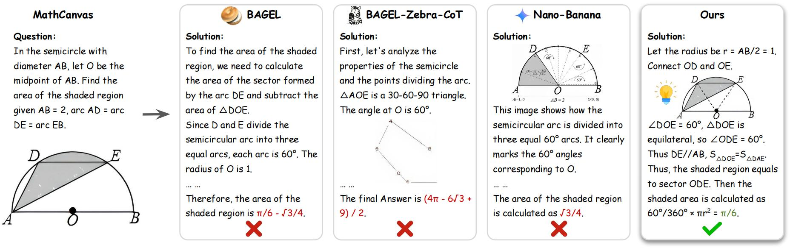
</p>
<p align="center">
  <small><i>
    MathCanvas demonstrates the first successful application of intrinsic Visual Chain-of-Thought (VCoT) for complex mathematical reasoning, outperforming previous attempts.
  </i></small>
</p>

**MathCanvas** is a comprehensive framework designed to endow unified Large Multimodal Models (LMMs) with intrinsic **Visual Chain-of-Thought (VCoT)** capabilities for mathematics. Our approach enables models to strategically generate and reason with visual aids, mirroring how humans solve complex problems in domains like geometry and function analysis.

## 🚀 Model Training and Inference

For detailed instructions on setting up the environment, training the **BAGEL-Canvas** model, and running inference, please refer to our comprehensive guide:

*   **[📄 Model Usage](./BAGEL-Canvas/README.md)**: The complete guide for model training and inference.

## 📊 Evaluation

This section provides instructions for evaluating model performance on our **MathCanvas-Bench** benchmark. The evaluation process relies on an LLM-based judge (GPT-4.1) to assess the correctness of the generated answers.

To evaluate the inference results on **MathCanvas-Bench**, follow the steps below:

1.  **Configure the Evaluation Script**:
    Open the `evaluation/mathcanvas_evaluate_4.1.sh` script and set the `your_api_key` and `your_base_url` variables.

2.  **Run Evaluation**:
    Execute the following command, replacing `{INFERENCE_DIR}` with the path to your inference output.

    ```bash
    cd MathCanvas/evaluation
    bash mathcanvas_evaluate_4.1.sh {INFERENCE_DIR}
    ```

3.  **View the Results**:
    After the script finishes, an evaluation summary will be generated. This summary includes detailed accuracy metrics, such as:
    *   Weighted scoring accuracy and complete accuracy.
    *   Accuracy broken down by knowledge category.
    *   Accuracy based on whether the question includes initial images.

## 🧬 Data Generation

This section details the process for generating the **Foundational Structure Generation** subset of the `MathCanvas-Edit` dataset. Our synthesis pipeline for foundational geometric structures is based on the official implementation of [AlphaGeometry](https://github.com/google-deepmind/alphageometry).

### Environment Setup

Before running the generation script, you must set up the environment required by AlphaGeometry. Please refer to their official repository and follow the installation instructions.

### Usage

Once the environment is configured, you can generate the data by running the provided script.

```bash
cd foundations_synthesis/
bash foundations_synthesis.sh
```

You can customize the generation process by modifying the `foundations_synthesis.sh` script. This includes parameters such as the total number of samples to generate and the length of the editing sequences.

For convenience, we have already generated **1 million** editing sequences for this subset. You can directly access and download them from our dataset repository on Hugging Face: 

*   **[🤗 MathCanvas-Edit Dataset](https://huggingface.co/datasets/shiwk24/MathCanvas-Edit)**.


## ✨ Highlights

### MathCanvas-Bench & MathCanvas-Instruct

To facilitate rigorous evaluation, we introduce **MathCanvas-Bench**, a challenging benchmark with 3K problems that require models to produce interleaved visual-textual solutions. The models are fine-tuned on **MathCanvas-Instruct**, a new 219K-example dataset of interleaved visual-textual reasoning paths, teaching them *when* and *how* to leverage visual aids.

<p align="center">
  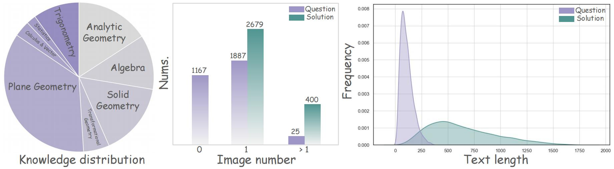
</p>
<p align="center">
  <small><i>
    Statistical analysis of the MathCanvas-Bench dataset.
  </i></small>
</p>

<details>
  <summary>Examples from the MathCanvas-Instruct dataset, showing interleaved visual and textual reasoning steps.</summary>
  <p align="center">
    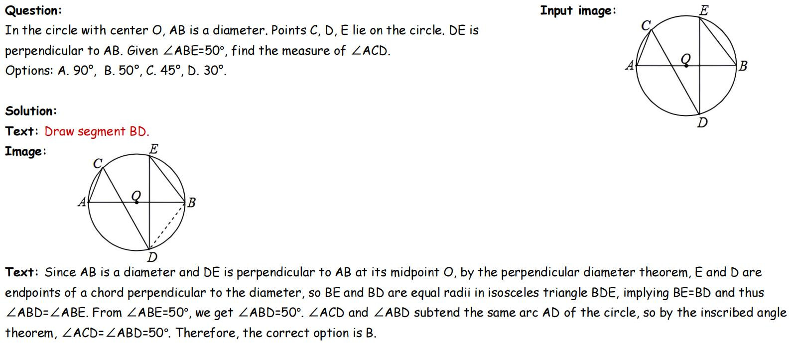
    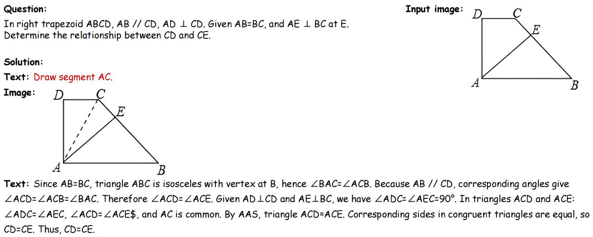
    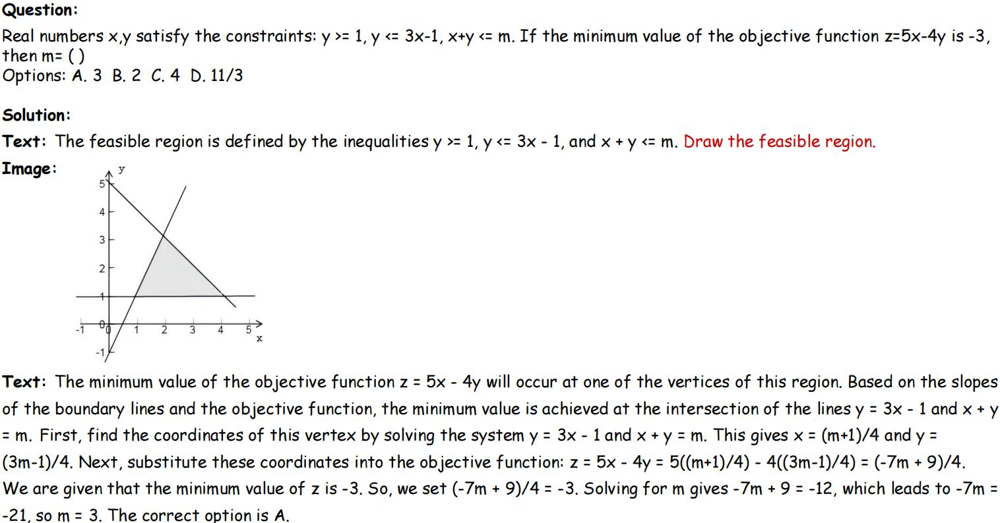
  </p>
</details>

### MathCanvas-Edit & MathCanvas-Imagen

We constructed a massive 15.2M-pair pre-training corpus to teach foundational visual manipulation skills. This includes **MathCanvas-Imagen** (10M caption-to-diagram pairs) for mastering diagram generation and **MathCanvas-Edit** (5.2M step-by-step editing trajectories) for diagram editing.

<p align="center">
  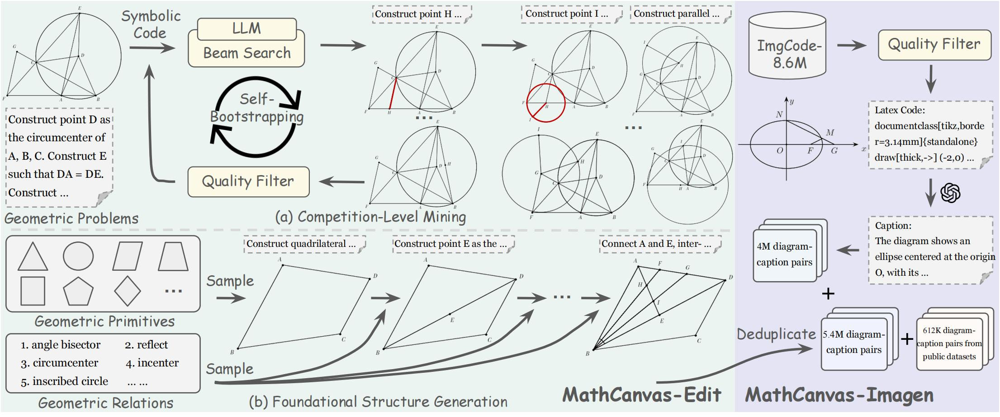
</p>
<p align="center">
  <small><i>
    The curation pipeline for the MathCanvas-Edit and MathCanvas-Imagen datasets.
  </i></small>
</p>

<details>
  <summary>Examples from the MathCanvas-Edit and MathCanvas-Imagen datasets.</summary>
  <p align="center">
    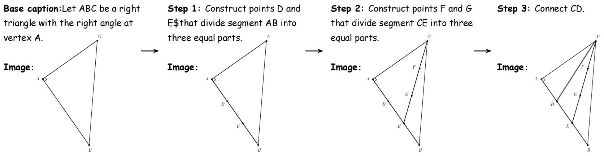
    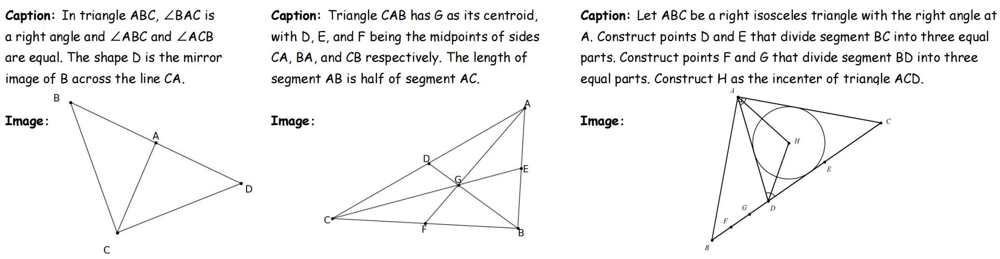
    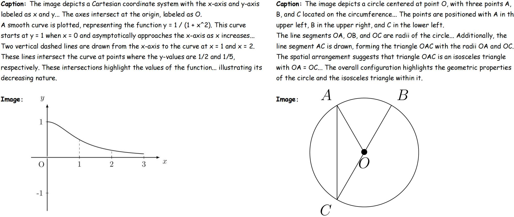
  </p>
</details>

### Two-Stage Training Recipe

Our model, **BAGEL-Canvas**, is trained using a two-stage framework:
1.  **Stage I: Mastering Visual Manipulation:** The model learns from the 15.2M examples in MathCanvas-Imagen and MathCanvas-Edit to create and edit mathematical diagrams.
2.  **Stage II: Developing Strategic Reasoning:** The model is then trained on MathCanvas-Instruct to strategically generate visual steps as part of a solution.

<p align="center">
  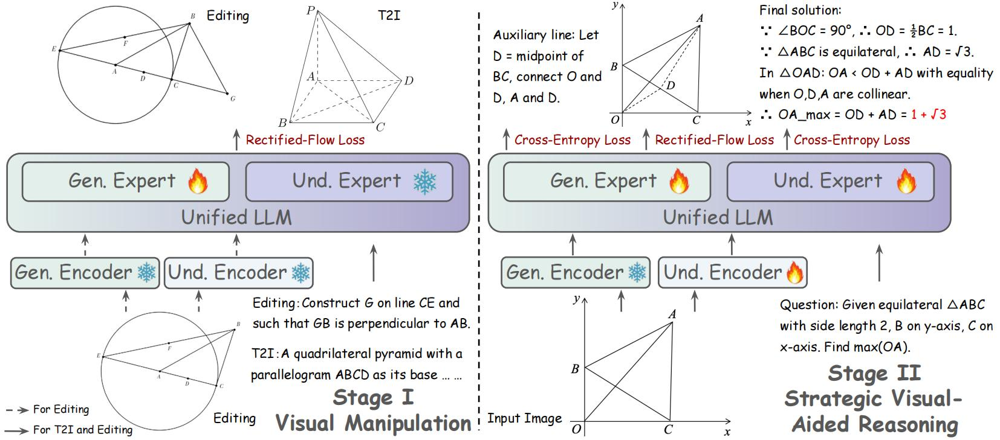
</p>
<p align="center">
  <small><i>
    The two-stage training framework of MathCanvas.
  </i></small>
</p>


## 📝 TODO

Our code and models are currently being prepared for public release. We appreciate your patience!

- [x] Release training and inference code for **BAGEL-Canvas**.
- [x] Release evaluation scripts for the **MathCanvas-Bench**.
- [x] Update the evaluation scripts for the **MathCanvas-Bench** to [VLMEvalKit](https://github.com/open-compass/VLMEvalKit).
- [x] Release the data generation code for **Foundational Structure Generation** in MathCanvas-Edit.

## Contact
If you have any questions, please <a href="https://github.com/shiwk24/MathCanvas/issues" target="_blank">raise an issue</a> or contact us at <a href="mailto:wkshi@link.cuhk.edu.hk">wkshi@link.cuhk.edu.hk</a>.

## 📜 Citation

If you find our work useful for your research, please consider citing our paper:

```bibtex
@misc{shi2025mathcanvasintrinsicvisualchainofthought,
      title={MathCanvas: Intrinsic Visual Chain-of-Thought for Multimodal Mathematical Reasoning}, 
      author={Weikang Shi and Aldrich Yu and Rongyao Fang and Houxing Ren and Ke Wang and Aojun Zhou and Changyao Tian and Xinyu Fu and Yuxuan Hu and Zimu Lu and Linjiang Huang and Si Liu and Rui Liu and Hongsheng Li},
      year={2025},
      eprint={2510.14958},
      archivePrefix={arXiv},
      primaryClass={cs.CV},
      url={https://arxiv.org/abs/2510.14958}, 
}
@inproceedings{
  wang2025mathcodervl,
  title={MathCoder-{VL}: Bridging Vision and Code for Enhanced Multimodal Mathematical Reasoning},
  author={Ke Wang and Junting Pan and Linda Wei and Aojun Zhou and Weikang Shi and Zimu Lu and Han Xiao and Yunqiao Yang and Houxing Ren and Mingjie Zhan and Hongsheng Li},
  booktitle={The 63rd Annual Meeting of the Association for Computational Linguistics},
  year={2025},
  url={https://openreview.net/forum?id=nuvtX1imAb}
}
```